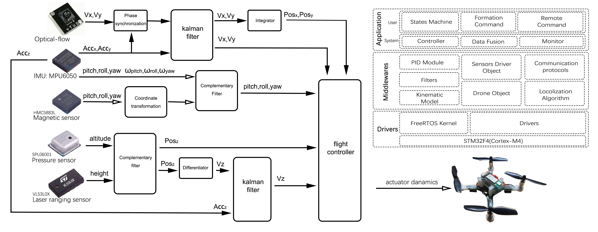
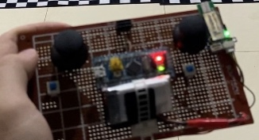

# GEARDRONE_LITE

GEARdrone for STM32F103

GEARdrone_Lite包含了完整的飞行控制器和机载UWB相对定位算法，可以在4基站模式下实现相对定位，或直接使用光流传感器进行定位悬停。

具体功能请查阅软件工程代码

# GEARDRONE_F4

 GEARdrone for STM32F411

F4版本飞控由于本人精力有限，在数次因layout问题打样测试失败后已暂停开发

值得参考的内容是 GEARdrone-F4\GearLL\Middlewares\Algorithm 目录下的 NLR_localization 文件

NLR_localization在单片机中实现非线性回归，复现了参考文献[1]中的第一部分无人机相对位置初始化部分的内容

完整论文复现的matlab仿真可以在software文件夹中查阅。

# GEARREMOTE

遥控器GEARremote原本是为了控制单独一架无人机设计的，使用串口透传模块进行通讯。但在后期编队开发中，为了下达广播起飞指令，遥控器摒弃了原先的设计，一直以面包板的形式支持无人机编队的开发，没有专门的PCB工程。

参考文献：

[1] Guo K, Xie L. INFRASTRUCTURE-FREE COOPERATIVE RELATIVE LOCALIZATION FOR UAVS IN GPS-DENIED ENVIRONMENTS[J]. International Journal of Robotics and Automation, 2021, 36(6).

[2] Nguyen T M, Zaini A H, Guo K, et al. An ultra-wideband-based multi-UAV localization system in GPS-denied environments[C]//2016 International Micro Air Vehicles Conference. 2016, 6: 1-15.

[3] Guo K, Qiu Z, Miao C, et al. Ultra-wideband-based localization for quadcopter navigation[J]. Unmanned Systems, 2016, 4(01): 23-34.

[4] Guo K, Li X, Xie L. Ultra-wideband and odometry-based cooperative relative localization with application to multi-UAV formation control[J]. IEEE transactions on cybernetics, 2019, 50(6): 2590-2603.
